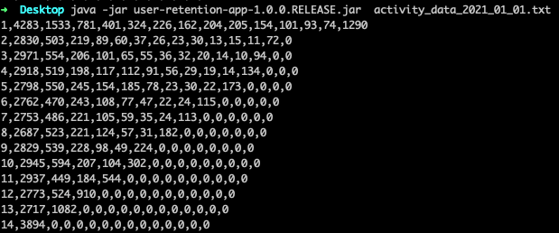
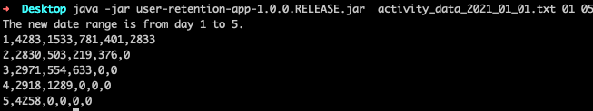
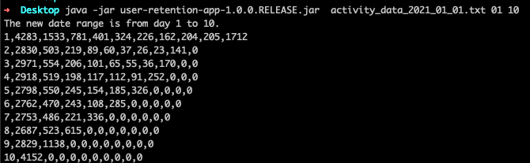
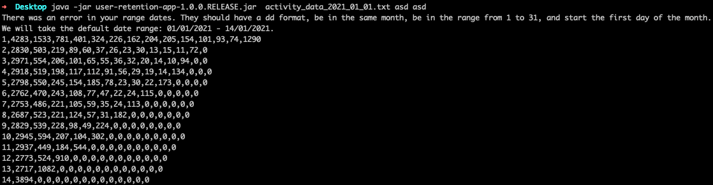
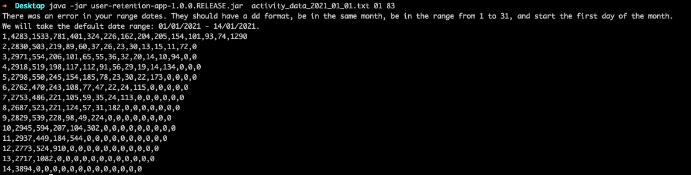
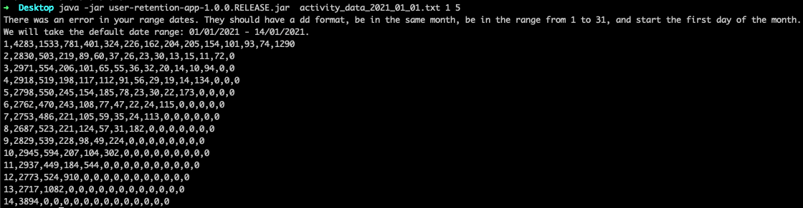
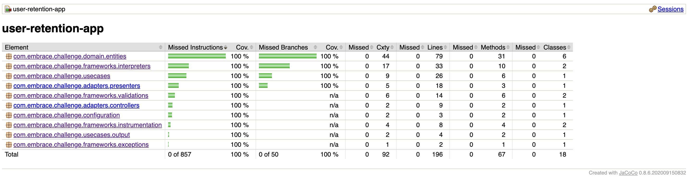
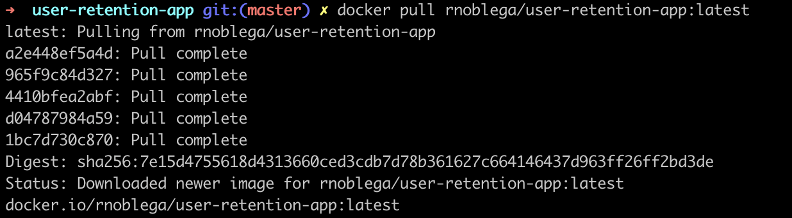
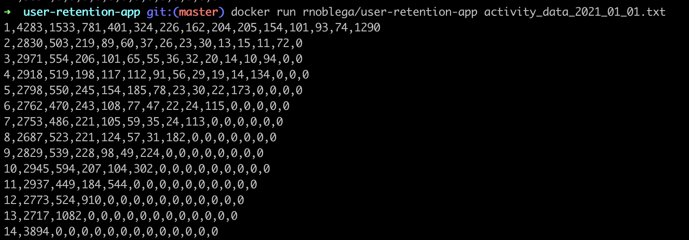

# User Retention App

This is a Java Gradle application to analyze an application's user retention as we compute the number of users that use the application for a number of consecutive days.

## How to run the application

1. Install [Java 11](https://oracle.com/ar/java/technologies/javase/jdk11-archive-downloads.html)

2. Download the [User Retention](https://github.com/rodrinoblega/user-retention-app) GitHub repository  

3. At the root of the project, The last version of .jar was left. It's called user-retention-app-1.0.0.RELEASE.jar

4. Go to the project's root and run it in your terminal

   `java -jar user-retention-app-1.0.0.RELEASE.jar {fileToProcess}`

3. The console should show you the response as follow:

    

## Considerations

- It was considered that the input of the application is a file that always has information from the same month
- It was considered that the default range of days is from 1 to 14
- We have the possibility to specify a custom range of days, but there are some validations to have in mind:
  - The custom range of days must be between 01 and 31
  - The custom range of days must be started from 01
  - The custom range of days must have dd format
- If any of these validations are not met, we will take the default range of days (1-14)

### Valid cases:
  

    - Custom range of days: 01 to 05
  

    - Custom range of days: 01 to 10
  

    
### Not valid cases:

    - Range of days as string:
  

    - Invalid final day range:
  

    - Range of days with no dd format:
  

## Test

The JaCoCo plugin provides code coverage metrics for Java code via integration with [JaCoCo](https://docs.gradle.org/current/userguide/jacoco_plugin.html)

This plugin was used in this project reaching 100% of coverage in the lines of code:

## Docker

The app is uploaded as an image in [rnoblega/user-retention-app](https://hub.docker.com/repository/docker/rnoblega/user-retention-app)

You should have [Docker](https://www.docker.com/) installed

- The file activity_data_2021_01_01.txt is located in the image
- Pull the repository

 `docker pull rnoblega/user-retention-app:latest`

   

- Run the repository
  
  `docker run rnoblega/user-retention-app activity_data_2021_01_01.txt`

    - NOTE: May run a bit slower than running the jar directly

## Questions

* [rnoblega@gmail.com](rnoblega@gmail.com)
